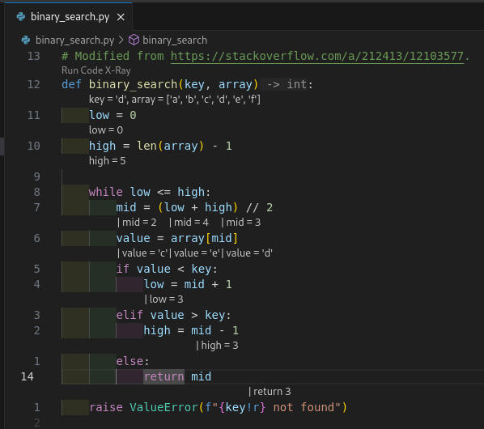
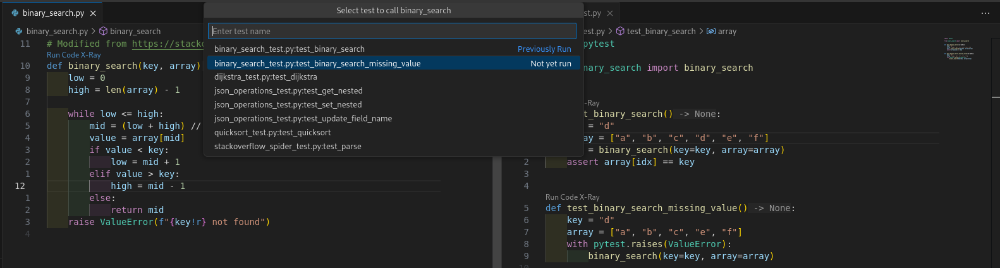
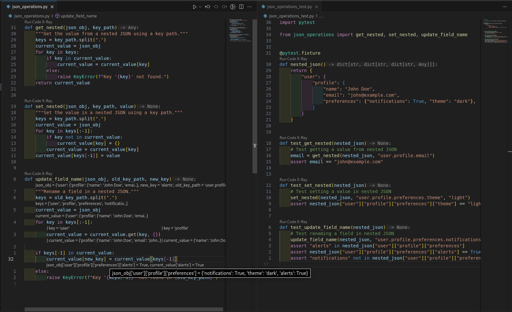
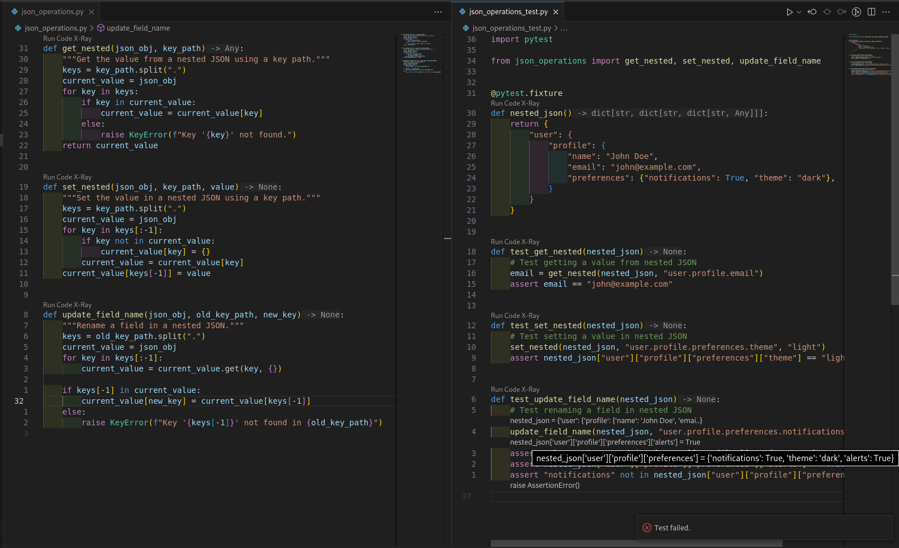
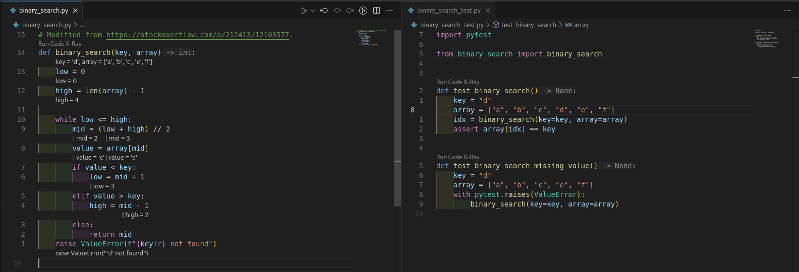

# Code X-Ray
Have you noticed that your code is opaque.
There's so much happening between the lines that you can't even see.
Well, now you can:  

## Usage
0. Make sure you have Python>=3.11 installed.
1. **Python: Select Interpreter** to get the environment with your packages installed.
1. Write your tests in the same workspace.
1. Click `Run Code X-Ray` or type `Ctrl+Enter` in the function definition.
1. Select the test to run.

### Advanced Usage
- Use `Ctrl+Del` to remove annotations.
- Hover over the annotations for more info.

- Run on your tests as well as your code.

## Examples
See the [images/](images/) directory for more screenshots.
Head over to https://github.com/George-Ogden/code-xray-samples to run in the sample repository.
## Issues and Limitations
The annotations are only as good as the debugger makes them.
To get the most out of this project:
- write clean code
- use temporary variables
- define `__repr__` on your classes

Currently, Python is the only language supported.
If there's enough demand, I might add other languages.

This code is designed to help you write fewer bugs.
But it is almost certainly not bug-free itself.
Please, use the issue tracker to report issues.
## Inspiration
This project was inspired by Bret Victor's talk "Inventing on Principle".
That's why I've used the binary search example:

